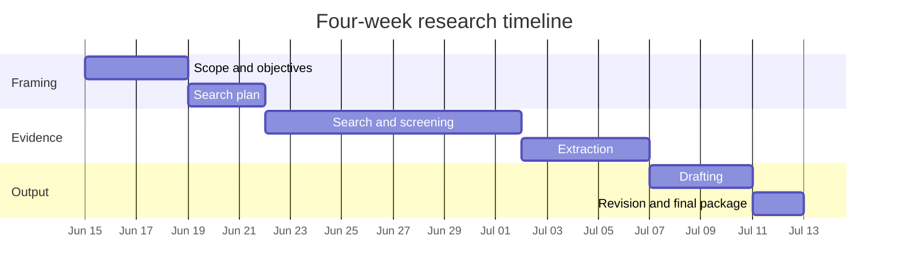
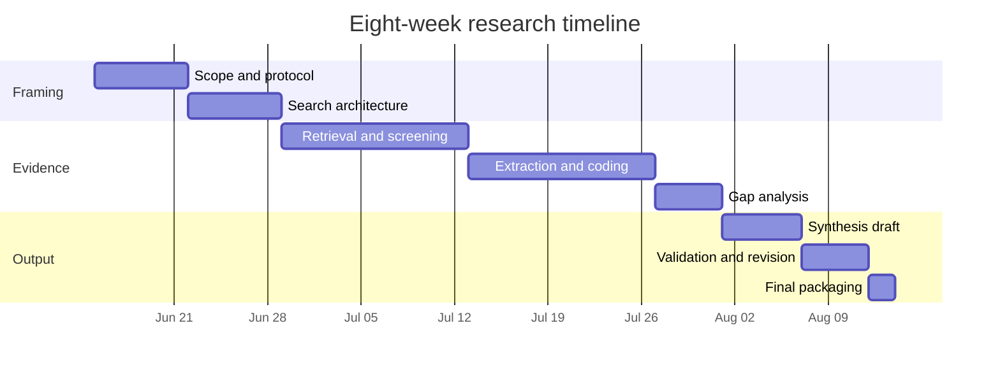
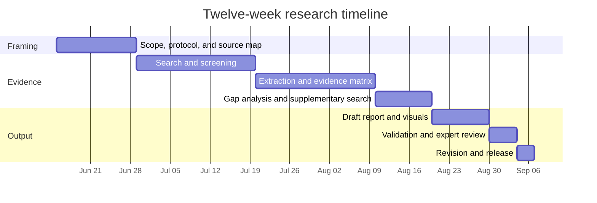
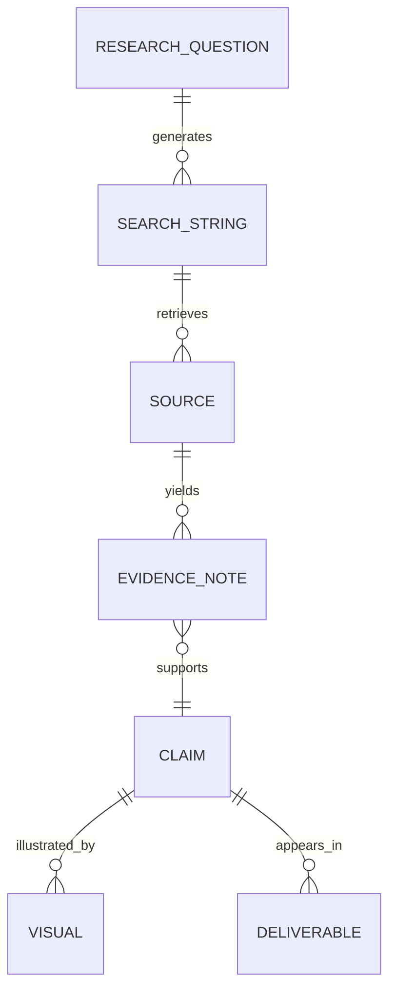

# Deep Research Planning Framework for an Undefined Topic

## Executive Summary

When the topic is not yet tightly defined, the highest-value first output is a scoping protocol, not a premature literature summary. A strong protocol forces decisions about the question, audience, deliverable, evidence standards, timeline, data sensitivity, and source priorities before the search space expands. That approach is consistent with structured review practice in PRISMA 2020, with FAIR data principles that emphasize persistent identifiers, rich metadata, searchable registration, and standardized retrieval, and with NIH guidance that treats repository choice, budgeting, privacy, and data access as design decisions rather than afterthoughts. citeturn5view0turn6view0turn16view3

A practical research system should combine broad discovery tools with field-specific databases and official source portals rather than treating them as interchangeable. Google Scholar is useful for broad discovery and citation chaining across disciplines; PubMed is stronger for biomedical retrieval because it supports MeSH, Boolean logic, field tags, and proximity searching; ERIC adds a thesaurus and peer-reviewed/full-text filters for education topics; and applied work often depends most on primary official portals such as SEC EDGAR, Congress.gov, EUR-Lex, data.gov, FRED, OECD, NASA Open Data, and World Bank repositories. citeturn19view0turn19view2turn18view0turn18view1turn18view2turn18view3turn4view3turn7view5turn4view4turn14view0turn14view2turn5view5turn7view2turn7view0turn17view2turn10view0

Although your prompt says to assume no topic is specified, the uploaded brief appears to define a concrete candidate topic: a practical, rule-based Smart Money Concepts intraday/scalping framework focused on XAUUSD/gold and adaptable to forex and indices. The report below therefore stays topic-agnostic, but it is immediately applicable to that trading-framework brief as a worked example. fileciteturn0file0

## Defining the Topic and Success Criteria

A topic becomes researchable only after it is translated into a decision-oriented brief. The aim is to move from “research this topic” to a statement that specifies what must be answered, for whom, by when, using which kinds of evidence, and in what output format. PRISMA’s emphasis on explicit scope and reporting, together with FAIR’s emphasis on metadata and traceability, makes this explicit framing step especially valuable for both academic and applied work. citeturn5view0turn6view0

> **Working note:** the uploaded trading brief already answers some scoping elements, including domain, operating style, desired output structure, and implementation orientation. It still leaves important planning choices unresolved, such as evidence standards, acceptable data sources, evaluation period, and the exact decision use case for the final product. fileciteturn0file0

### Clarifying question checklist

| Category | Question the user should answer | Why it matters |
|---|---|---|
| Scope | What is the exact topic in one sentence? | Prevents drift and sets the search boundary. |
| Scope | What is **in scope** and explicitly **out of scope**? | Stops literature sprawl and keeps synthesis coherent. |
| Objective | What decision, action, or claim must the research support? | Defines what counts as “useful” evidence. |
| Audience | Who is the primary audience: expert, executive, client, regulator, student, or internal team? | Changes depth, vocabulary, and evidence threshold. |
| Timeline | What deadline matters: exploratory draft, interim briefing, or final deliverable date? | Determines how much search, validation, and revision are realistic. |
| Time horizon | What publication window matters: last 12 months, last 5 years, historical trend, or all relevant literature? | Controls recency filters and how much archival work is needed. |
| Geography | Is the work global, country-specific, market-specific, or institution-specific? | Determines which laws, datasets, and official sources matter most. |
| Depth | Is the task a rapid scan, a deep literature review, a systematic review, or a decision memo? | Changes search breadth, extraction detail, and documentation rigor. |
| Deliverables | What outputs are required: report, slide deck, executive summary, appendix, spreadsheet, or code repository? | Prevents rework late in the project. |
| Source preference | Should primary sources dominate, or are secondary syntheses acceptable for background? | Affects evidence hierarchy and time spent validating summaries. |
| Access constraints | Are paywalled databases, proprietary reports, or subscription tools available? | Changes feasible database coverage even when budget is not the main issue. |
| Language | Must all sources be in English, or should multilingual evidence be searched and translated? | Avoids language bias and missed regional evidence. |
| Format | Is prose output enough, or are tables, timelines, dashboards, and formal citations required? | Determines how notes should be structured from the start. |
| Visuals | Which visuals are expected: process maps, time-series charts, comparison tables, maps, or conceptual diagrams? | Prevents discovering too late that the data do not support the visuals. |
| Data needs | Is original data analysis required, or only literature synthesis? | Determines whether a data pipeline and reproducible code are necessary. |
| Ethics and privacy | Will the project involve personal data, human subjects, confidential documents, or controlled-access data? | Affects consent, storage, de-identification, access control, and publication choices. |

A useful one-sentence brief template is:

`Research [topic] for [audience] to answer [decision/question] by [date], using [priority source types], at [depth], delivered as [formats], subject to [privacy/ethics/access constraints].`

For the uploaded trading brief, a first-pass filled version might read: “Research and codify a testable, rule-based SMC intraday framework for XAUUSD for practical trader execution and evaluation, using primary market-structure literature, official/regulatory references where relevant, and reproducible testing artifacts, delivered as a manual plus checklists and backtesting templates.” fileciteturn0file0

## Research Method and Search Design

A good method should be explicit enough to repeat and flexible enough to work across academic and applied projects. In practice, that means combining discovery, screening, extraction, synthesis, validation, and revision with the right tool for each stage. Scholar supports broad cross-disciplinary discovery and citation chaining; PubMed supports controlled vocabulary and structured query syntax; ERIC supports thesaurus-based educational retrieval; arXiv is valuable for recent work but states that materials on the site are not peer reviewed by arXiv; Crossref and Semantic Scholar help with metadata expansion and citation chasing; and Zotero, Quarto, Jupyter, Git, and GitHub support bibliographies, reproducible publication, notebooks, version control, and collaboration. citeturn19view0turn19view2turn18view0turn18view1turn18view2turn18view3turn4view3turn7view5turn3view0turn9view0turn9view2turn6view1turn21view0turn21view1turn22view0turn22view1

### Step-by-step methodology

| Phase | Core task | Academic adaptation | Applied adaptation | Recommended tools and databases | Minimum output |
|---|---|---|---|---|---|
| Scope and protocol | Define question, inclusion criteria, exclusions, deliverables | Frame a research question, concepts, and theory boundary | Frame a business/policy/operational question and decision use case | Brief document, concept map, search log, Zotero collection | 1-page scoping brief |
| Search design | Build search strings and source list | Use database syntax, controlled vocabulary, citation chasing | Mix scholarly search with official portals, filings, datasets, standards, and guidance | Google Scholar, PubMed, ERIC, arXiv, Crossref, Semantic Scholar, official portals | Search plan |
| Source retrieval | Gather candidate evidence | Pull papers, preprints, review articles, datasets | Pull laws, filings, dashboards, government data, vendor docs, and technical references | Scholar links, database exports, PDFs, official repositories | Source inventory |
| Screening and prioritization | Decide what to keep | Rank by relevance, method quality, and recency | Rank by authority, operational relevance, and decision usefulness | Zotero tags, spreadsheet screening log | Inclusion list |
| Data extraction | Convert reading into structured evidence | Extract methods, sample, outcome, limitations | Extract claims, definitions, process rules, metrics, and implementation constraints | Evidence matrix in spreadsheet or notebook | Evidence table |
| Synthesis | Turn notes into an argument | Compare findings, methods, and contradictions | Compare options, risks, edge cases, and trade-offs | Thematic outline, comparison tables, narrative memo | Draft synthesis |
| Gap analysis | Identify what is still missing | Note under-studied questions, uncertain results, missing populations | Note missing benchmarks, absent policy guidance, weak data coverage, or untested assumptions | Assumption log, “known unknowns” table | Gap memo |
| Validation | Stress-test conclusions | Check against primary studies and established reviews | Check against official rules, current stats, original filings, or domain docs | Back-checking, version review, source audit | Validation checklist |
| Writing and revision | Produce final outputs | Align claims to evidence and citation style | Align recommendations to audience needs and executable decisions | Quarto, Jupyter, Git/GitHub, Zotero | Final package |

### Workflow diagram

```mermaid
flowchart LR
    A[Scope and objectives] --> B[Search plan]
    B --> C[Discovery and retrieval]
    C --> D[Screening and prioritization]
    D --> E[Evidence extraction]
    E --> F[Synthesis]
    F --> G[Gap analysis]
    G --> H[Validation]
    H --> I[Writing and revision]
    I --> J[Final deliverables]
```

### Query templates and Boolean examples

Database syntax varies. PubMed, for example, supports Boolean logic, field tags, MeSH terms, and proximity searching; ERIC exposes thesaurus terms and peer-reviewed/full-text filters; Google Scholar works well for broad discovery and citation chaining rather than rigid database-style field logic. Use the strings below as templates, then adapt them to the specific platform. citeturn18view0turn18view1turn18view2turn18view3turn19view0turn19view2turn4view3turn7view5

| Discipline | Academic database string | Web search string |
|---|---|---|
| Clinical medicine | `"type 2 diabetes"[mh] AND "continuous glucose monitoring"[tiab] AND (trial[tiab] OR randomized[tiab]) NOT pediatric[tiab]` | `site:nih.gov OR site:clinicaltrials.gov "continuous glucose monitoring" "type 2 diabetes" randomized` |
| Public health | `("air pollution" OR PM2.5) AND ("cardiovascular mortality" OR stroke) AND (cohort OR longitudinal)` | `site:who.int OR site:cdc.gov "air pollution" cardiovascular mortality PM2.5` |
| Psychology | `("cognitive behavioral therapy" OR CBT) AND insomnia AND (meta-analysis OR systematic review)` | `site:apa.org OR site:nih.gov CBT insomnia meta-analysis` |
| Education | `("learning loss" OR "achievement gap") AND ("elementary school" OR "primary school") AND (tutoring OR intervention*)` | `site:eric.ed.gov "learning loss" elementary school tutoring` |
| Computer science | `("retrieval-augmented generation" OR RAG) AND (evaluation OR benchmark) AND hallucination` | `site:arxiv.org OR site:dblp.org "retrieval-augmented generation" benchmark hallucination` |
| Economics | `("minimum wage" AND employment) AND (elasticity OR "difference-in-differences")` | `site:fred.stlouisfed.org OR site:worldbank.org minimum wage employment elasticity` |
| Finance and trading | `("gold" OR XAUUSD OR "gold futures") AND ("market microstructure" OR liquidity) AND intraday AND volatility` | `site:scholar.google.com OR site:arxiv.org "gold market microstructure" intraday liquidity volatility` |
| Environmental science | `("climate adaptation" AND agriculture) AND (smallholder OR farmer) AND ("South Asia" OR India)` | `site:worldbank.org OR site:oecd.org "climate adaptation" agriculture South Asia` |
| Law and policy | `("algorithmic discrimination" OR "AI bias") AND (employment OR hiring) AND regulation` | `site:congress.gov ("algorithmic discrimination" OR "AI bias") OR site:eur-lex.europa.eu ("artificial intelligence" discrimination employment)` |
| Engineering and energy | `("battery thermal management" AND "electric vehicles") AND (simulation OR experiment*)` | `site:nasa.gov OR site:energy.gov "battery thermal management" electric vehicles` |

A useful operating rule is to run each topic through three passes: a broad discovery query, a precision query with controlled vocabulary or field tags, and a primary-source query limited to official domains or original repositories. For the uploaded trading brief, the finance/trading row should be paired with economics, law/policy, and official data queries if the project needs macro/news or compliance context. fileciteturn0file0

## Schedules and Deliverables

The timelines below assume an illustrative project start on **Monday, June 15, 2026**, which is the first working day after the current date of **Saturday, June 13, 2026** in Asia/Kolkata. They are designed for three common modes: a rapid but disciplined scan, a standard deep-research cycle, and a fuller research-and-validation program.

### Suggested milestone logic

| Project length | Best use | Early milestone | Middle milestone | Final milestone |
|---|---|---|---|---|
| 4 weeks | Rapid briefing or exploratory synthesis | Scope locked and search plan approved by end of Week 1 | Evidence table and preliminary synthesis by end of Week 3 | Final brief and appendix in Week 4 |
| 8 weeks | Standard deep-research project | Scope and source map by Week 2 | Extraction, gap analysis, and draft by Weeks 4–6 | Validation, revision, and polished package by Week 8 |
| 12 weeks | High-stakes or data-heavy project | Protocol, search, and screening complete by Week 3 | Extraction and core analysis by Weeks 4–8 | Validation, packaging, and stakeholder revision by Weeks 9–12 |

### Four-week plan

### Eight-week plan

### Twelve-week plan

### Deliverable formats and effort

Effort estimates below assume that the evidence base already exists and the work shown is the **incremental packaging effort**.

| Deliverable | Minimal template | Typical incremental effort | Relative effort | Best use |
|---|---|---:|---|---|
| Executive summary | Problem, answer, 3–5 key findings, risks, recommendation | 0.5–1 day | Low | Leadership briefing |
| Short report | Question, method, findings, interpretation, limitations, references | 2–4 days | Medium | Standalone readout |
| Slide deck | Situation, evidence, comparison, conclusion, next actions | 1–3 days | Medium | Meeting or presentation |
| Data appendix | Data sources, definitions, extraction table, caveats, raw outputs | 1–3 days | Medium | Auditability |
| Reproducible code package | README, notebook/script, environment file, outputs, instructions | 1–4 days | Medium to high | Re-running or extending analysis |
| Full research bundle | Report + executive summary + slides + appendix + code | 5–10 days | High | High-stakes delivery |

A strong default package for most serious projects is: **one report, one 1–2 page executive summary, a data/evidence appendix, and a reproducible repository if any original analysis is involved**.

## Source Priorities, Reproducibility, and Visual Design

Primary and official sources should lead; discovery layers should support them. In practice, that means using Google Scholar or Semantic Scholar to locate material, then validating the underlying paper, registry entry, filing, legislation, dataset, or official method note. It also means treating recent preprints carefully, because arXiv explicitly notes that materials on the site are not peer reviewed by arXiv. citeturn19view0turn19view2turn9view2turn3view0

### Prioritized authoritative sources by discipline

| Discipline or use case | Prefer first | Use second | Why this priority |
|---|---|---|---|
| Cross-disciplinary discovery | Google Scholar | Crossref, Semantic Scholar | Scholar is best for broad scholarly discovery and citation chaining across disciplines; Crossref supports metadata retrieval and linking; Semantic Scholar adds a large paper corpus and API. citeturn19view0turn19view2turn9view0turn9view2 |
| Medicine and clinical research | PubMed | ClinicalTrials.gov, NIH/CDC/WHO guidance | PubMed supports MeSH, Boolean logic, field tags, and proximity searching; ClinicalTrials.gov is a searchable source of study records. citeturn18view0turn18view1turn18view2turn18view3turn10view1 |
| Computer science, math, physics | Google Scholar | arXiv, dblp | Scholar works well for discovery; arXiv is a free open-access archive for multiple quantitative fields but its materials are not peer reviewed by arXiv; dblp offers precise computer science publication search and export formats. citeturn19view0turn3view0turn8view0 |
| Education | ERIC | Official education departments and stats portals | ERIC provides a thesaurus plus peer-reviewed and full-text filters, making it strong for structured education searches. citeturn4view3turn7view5 |
| Economics and macro policy | FRED | World Bank, OECD | FRED provides tools, API access, and economic data; World Bank adds working papers, open repositories, and development data; OECD adds indicators, methods, dashboards, and the Data Explorer. citeturn7view2turn10view0turn7view0turn7view1 |
| Corporate, accounting, markets, regulation | SEC EDGAR | Company IR pages and regulator releases | EDGAR offers free public access to millions of filings and includes search tools and APIs. citeturn4view4 |
| Law and public policy | Congress.gov | EUR-Lex, official national legislation sites | Congress.gov exposes legislation text, committee reports, Congressional Record, and CRS products; EUR-Lex provides access to EU treaties, legal acts, case law, and the Official Journal. citeturn14view2turn14view3turn14view0turn14view1 |
| Government and open data | data.gov | NASA Open Data, agency-specific portals | data.gov describes itself as the home of U.S. government open data and provides data, tools, and resources; NASA’s portal is a catalog of publicly available NASA datasets and points to APIs and archive systems. citeturn5view5turn17view2turn17view3 |

### Citation, reproducibility, and data management standards

A minimal reproducibility stack is straightforward: use a citation manager to store records and notes; use version control for drafts, code, and evidence tables; generate final outputs from source documents where possible; and archive the release version of code or data in a stable repository. Zotero supports bibliographies, citation styles, duplicate detection, notes, syncing, and groups; Git is a distributed version-control system; GitHub repositories preserve files plus revision history and collaboration; Quarto supports reproducible articles, presentations, and reports in multiple formats; Jupyter supports shareable computational documents; NIH guidance emphasizes repository selection, privacy, budgeting, and data access; and FAIR principles emphasize persistent identifiers, rich metadata, searchable indexing, and standardized retrieval. citeturn6view1turn22view0turn22view1turn21view0turn21view1turn16view3turn6view0

| Area | Best-practice rule | Minimum artifact |
|---|---|---|
| Citation capture | Save full citation metadata the first time a source is used; do not leave “fill later” placeholders | Zotero library or citation spreadsheet |
| Search logging | Record database, date, query string, filters, and hit count for every meaningful search | Search log tab |
| Evidence traceability | Every major claim in the draft should point to at least one primary or official source and one note in the evidence table | Claim-to-source mapping |
| Source hierarchy | Prefer original studies, official data, filings, laws, and methods docs before press summaries | Source-quality rubric |
| Version control | Keep drafts, code, tables, and figures in Git from the start | Git repository |
| Reproducible outputs | If any analysis is done, generate tables/figures from notebooks or parameterized documents | Jupyter notebook or Quarto project |
| Data handling | Keep raw data immutable; transform into clearly labeled processed files | `/raw` and `/processed` folders |
| Metadata | Add README files with definitions, units, provenance, and update dates | Project README + data dictionary |
| Privacy | Classify data sensitivity before collection; document de-identification and access controls | Privacy note or data handling memo |
| Archiving | Freeze the release version of code/data/appendices in a stable repository | Tagged Git release and archive snapshot |

### Suggested visualizations and when to use them

| Visualization | Use when | Avoid when |
|---|---|---|
| Comparison table | Comparing methods, policies, interventions, or frameworks | The differences are mostly numerical trends rather than categorical choices |
| Evidence matrix | Tracking sources, methods, findings, limits, and confidence | The project is purely exploratory and too early for structured extraction |
| Timeline or Gantt chart | Coordinating milestones or historic sequences | The work is one-off and does not need scheduling |
| PRISMA-style flow | Showing screening and inclusion logic in structured reviews | The search was informal and not documented |
| Line chart | Showing time-series change, volatility, trends, event windows | Categories rather than time drive the story |
| Map | Geography materially changes interpretation | Geographic variation is incidental |
| Process flowchart | Explaining a method, system, policy pathway, or workflow | Relationships are many-to-many rather than sequential |
| Entity relationship diagram | Showing how concepts, claims, sources, and deliverables connect | A simple linear process is enough |

### Entity relationship example

## Pitfalls and Immediate Next Steps

The most common research failures are structural rather than intellectual: weak scoping, using one discovery tool as if it were the entire evidence base, failing to distinguish preprints from validated work, skipping search logs, and packaging outputs only after analysis is already complete. Those errors are avoidable if source hierarchy, documentation, and reproducibility are designed at the beginning rather than bolted on at the end. citeturn19view0turn3view0turn5view0turn16view3

### Common pitfalls and mitigation

| Pitfall | Why it happens | Why it is risky | Mitigation |
|---|---|---|---|
| Topic is too broad | The question feels “obvious” so scoping is skipped | Search explodes and synthesis becomes vague | Force a one-sentence decision-oriented brief |
| Topic is too narrow too early | Premature certainty about the answer | Important counter-evidence is missed | Start broad, then narrow after the first screening pass |
| Only one search tool is used | Convenience | Coverage becomes biased by one index or ranking system | Use at least one broad discovery layer and one field-specific or official source set |
| Discovery tool is treated as the evidence base | Search results look comprehensive | Underlying primary sources are never verified | Cite the original paper, filing, law, or dataset wherever possible |
| Preprints are treated as settled evidence | Recent work appears first | Unreviewed or unstable claims are oversold | Use preprints for recency; validate important claims elsewhere |
| No search log is kept | It feels administrative | Queries cannot be reproduced or improved | Log every substantial search |
| Notes are unstructured | Reading outruns extraction discipline | Writing becomes slow and error-prone | Build an evidence matrix from the first serious source |
| Visuals are deferred until the end | Focus stays on prose | Missing data or wrong structure is discovered late | Decide the target visuals during scoping |
| Final format is ignored | “We’ll package later” mindset | Major rework appears in the last phase | Name final deliverables in the scoping brief |
| Privacy and ethics are ignored | The data seem harmless at first | Sharing, storage, and publication become risky later | Classify data sensitivity before collecting or combining data |

### Next-step checklist

| Priority | Action | Output | Typical effort |
|---|---|---|---:|
| High | Write the one-sentence brief using the template above | Scoping sentence | 15–30 min |
| High | Answer the clarifying-question table, even briefly | 1-page scoping memo | 30–60 min |
| High | Define the source hierarchy for the project | Primary/secondary source map | 20–30 min |
| High | Create a search log and evidence table before opening databases | Research workbook | 20–30 min |
| High | Pick the default deliverable bundle | Output plan | 10–15 min |
| Medium | Draft three search strings: broad, precise, and primary-source | Initial query set | 30–45 min |
| Medium | Run pilot searches in one broad tool and one domain-specific source | Pilot source inventory | 45–90 min |
| Medium | Screen the first 20–30 results and refine terminology | Revised query set | 60–90 min |
| Medium | Lock the project timeline to 4, 8, or 12 weeks | Schedule and milestone dates | 15–20 min |
| Medium | Set up Zotero plus Git/GitHub or equivalent folders/versioning | Working infrastructure | 30–60 min |
| Low | Decide whether a reproducible notebook or Quarto report is needed | Publication format choice | 15–20 min |
| Low | Define the visuals the final output must include | Visual plan | 15–30 min |

If the uploaded trading brief is the true project, the fastest practical start is to fill the scoping checklist against that brief, then begin with the **finance/trading**, **economics**, and **law/policy** query sets above, because the brief already implies a rule-based manual, testing orientation, and operational decision use case. fileciteturn0file0